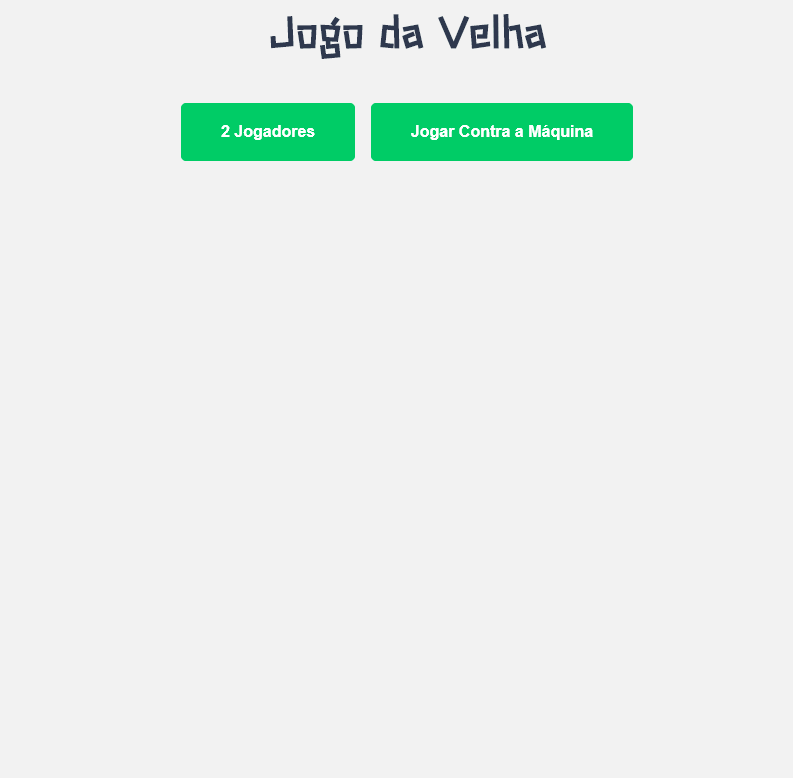

O objetivo do jogo da velha é fazer com que os jogadores, preencham lacunas de espaços vazios com um "X" ou "O". O jogador que alinhar três espaços vazios primeiro vence.
  

    
    
    

  

## 🔨 Tecnologias e Ferramentas Utilizadas

- HTML
- CSS
- JavaScript
- VSCode

  

## 💻 Projeto 

O jogo da velha foi desenvolvido durante o curso de JavaScript do Básico ao Avançado, para praticar o que foi ensinado durante o trajeto das aulas e fixar os conhecimentos obtidos.

  

Por Marco Santana